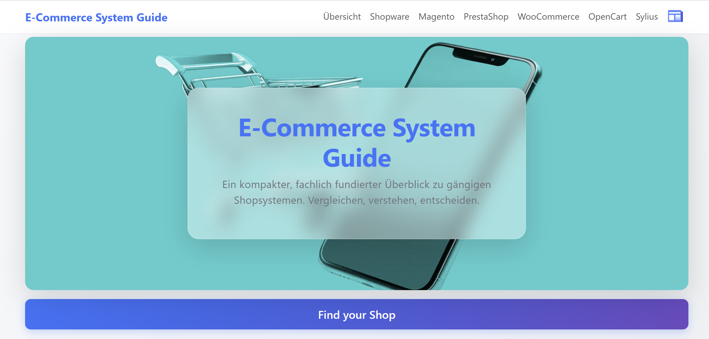
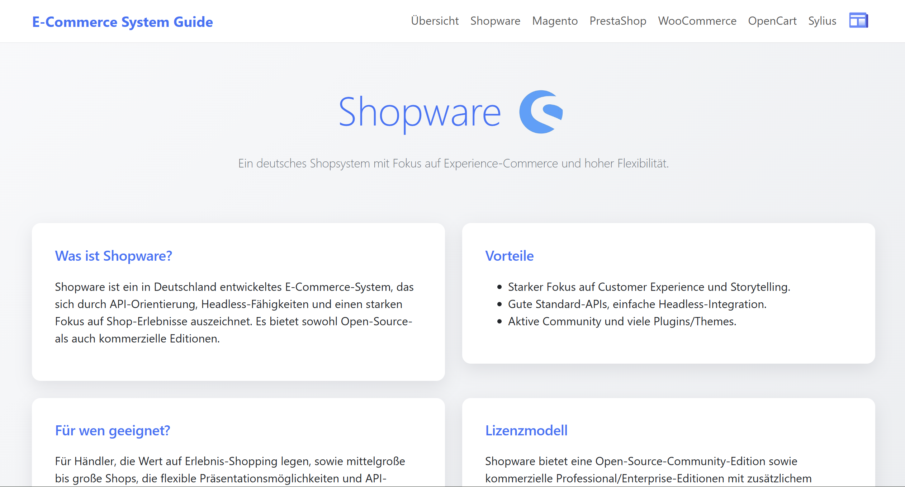
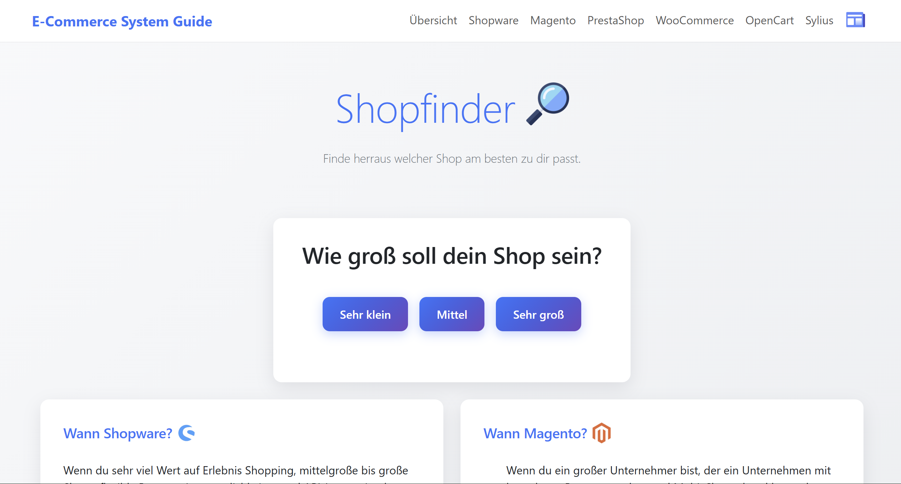
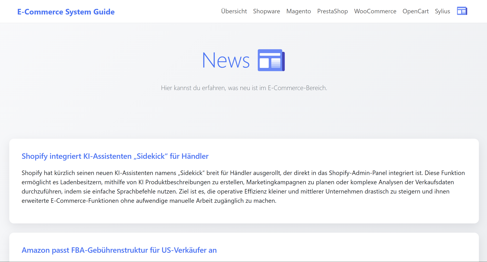

# Webshop Comparison Project

A beginner-friendly comparison website for popular e-commerce and webshop systems.  
The purpose of this project is to help users understand different webshop platforms and choose the most suitable one for their needs.

---

## Overview

This project provides structured information about well-known webshop systems:

- Shopify  
- WooCommerce  
- Magento  
- PrestaShop  
- OpenCart  
- Shopware  
- Sylius  

Each platform is described in a clear and simple way, focusing on:

- Main features  
- Advantages  
- Disadvantages  
- Typical use cases  

The goal is to make decision-making easier for beginners and small businesses entering e-commerce.

---

## Related Project

This project is also connected to a real-world website:

https://messerschmiede-schwaiger.at

It demonstrates practical application of the same development approach in a real business environment.

---

## Website Structure

The project consists of multiple static HTML pages:

- `index.html` – Homepage and introduction  
- `shopware.html` – Shopware overview  
- `shopify.html` – Shopify overview  
- `woocommerce.html` – WooCommerce overview  
- `magento.html` – Magento overview  
- `opencart.html` – OpenCart overview  
- `prestashop.html` – PrestaShop overview  
- `sylius.html` – Sylius overview  
- `shopfinder.html` – Interactive recommendation tool  
- `newsfeed.html` – AI-generated e-commerce news feed  

All pages share a consistent layout with navigation and footer.

---

## Design & Layout

- Clean and minimal design  
- Blue and white color scheme  
- Responsive layout using Bootstrap  
- Card-based content structure  
- Bootstrap Icons for UI elements  
- Consistent navigation across all pages  

---

## Features

### Shopfinder
An interactive questionnaire that suggests the most suitable webshop system based on user input.

### AI Newsfeed
A dynamic news section that:

- Fetches data via a Cloudflare Worker  
- Uses OpenAI (GPT) to generate summaries  
- Loads content dynamically via JavaScript (`assets/scripts/newsfeed.js`)

  

This demonstrates integration of a serverless backend with a static frontend.

---

## Technologies Used

- HTML5  
- CSS3  
- Bootstrap  
- JavaScript  
- Cloudflare Workers  
- OpenAI API  

---
